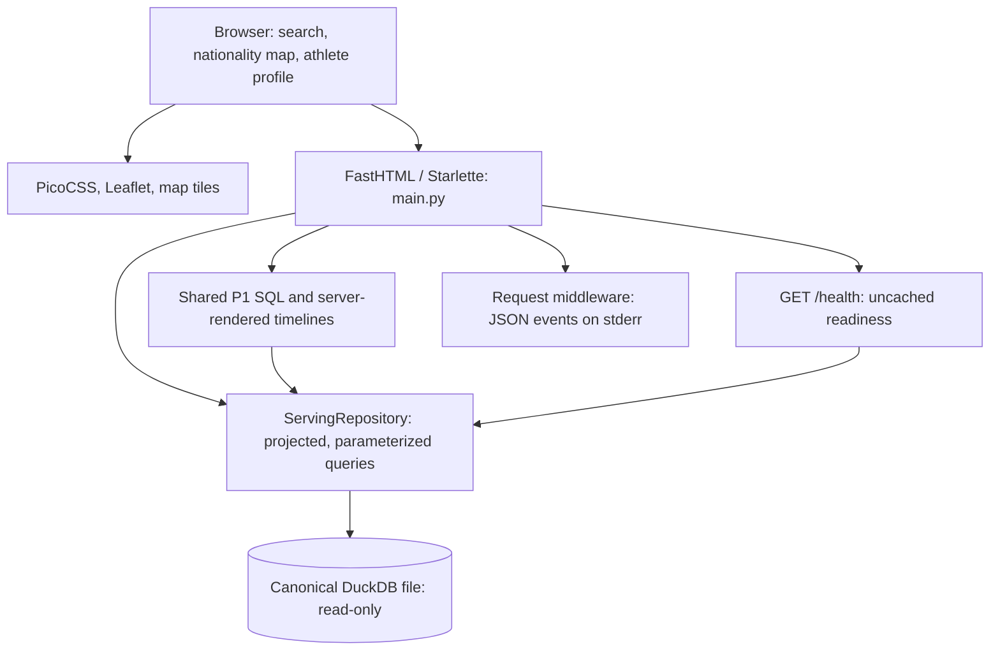
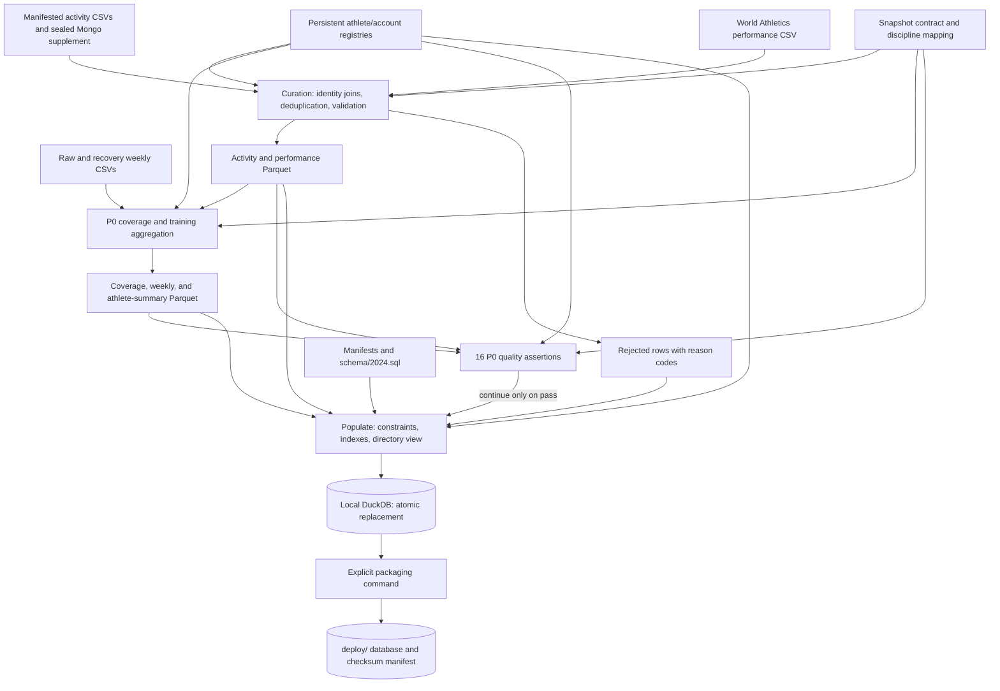
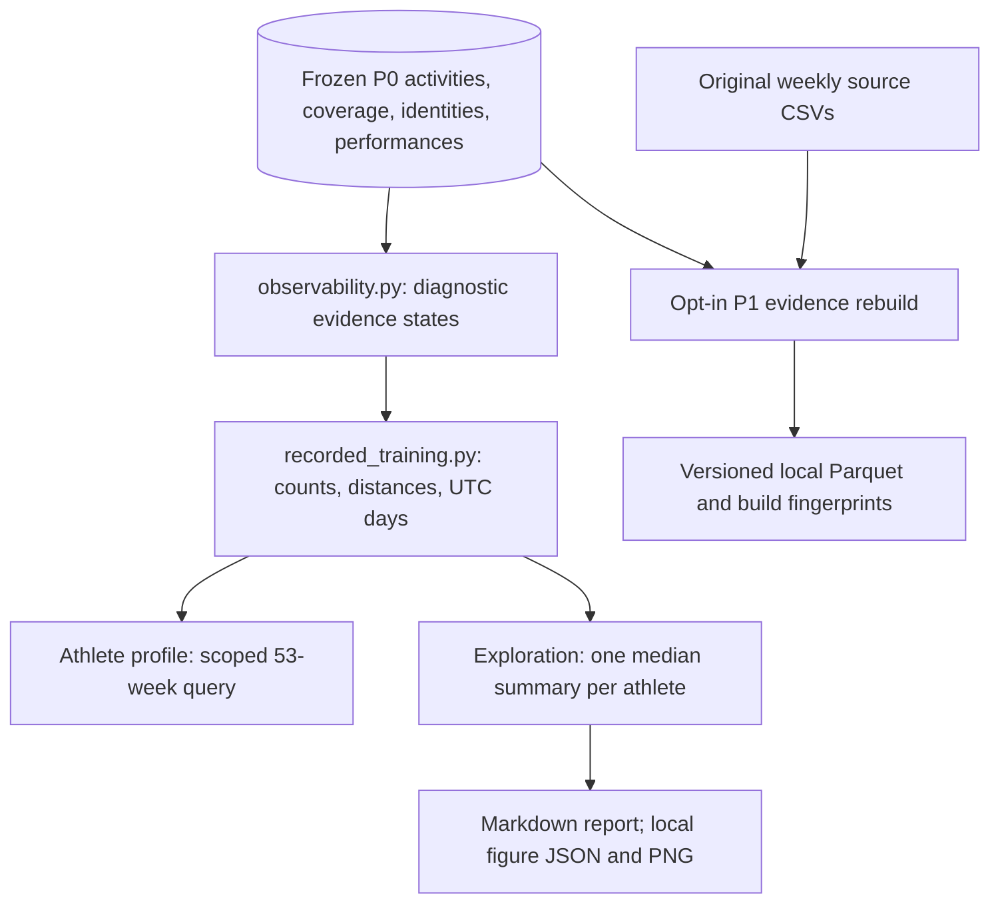
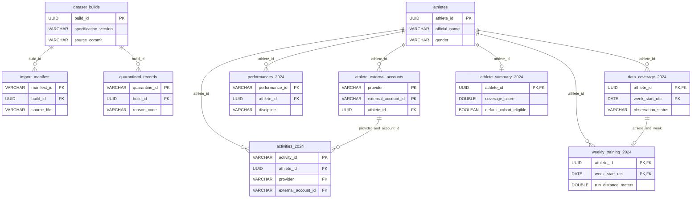

# Architecture, lineage, and schema

This documents the implemented P1 branch, not a claim that P1 is deployed. It separates the frozen P0 storage contract from the P1 calculations that read it. Live ingestion, PostgreSQL, prediction, and 2025 matching are not implemented components.

## Runtime architecture

The browser receives HTML/SVG and JSON API responses. Search, country rosters, activity filters, and pagination query the server. The map uses nationality centroids, not training locations. The browser does not open DuckDB or query Atlas.

The P1/Repository arrows represent cooperation, not a separate service: [`recorded_training.py`](../enduranceviz/recorded_training.py) supplies SQL; [`ServingRepository.recorded_weeks()`](../enduranceviz/serving.py) scopes and executes it; [`training_profile.py`](../enduranceviz/training_profile.py) renders the result. Activity-table filters leave the full-year running-chart denominators unchanged.

Database precedence is explicit argument → `ENDURANCEVIZ_DB_PATH` → local rebuilt file under `data/derived/2024/` → packaged `deploy/enduranceviz_2024.duckdb`. Production has no `data/` tree because [`.vercelignore`](../.vercelignore) excludes it. [`vercel.json`](../vercel.json) includes the packaged database and manifest as data artifacts. No request path writes canonical data.

Selected reads have bounded process-local LRU caches: athlete metadata, performances/accounts, country counts/rosters, and 128 athlete-week results. Search and activity-page queries are uncached. The homepage has a separate process-local cache. `/health` bypasses these caches. Replacing an immutable snapshot requires restarting/replacing the process; this is not a distributed cache with automatic invalidation.

[`main.py`](../main.py) implements `/`, `/athlete/{athlete_id}`, search/map/country APIs, `/api/snapshot`, and `/health`. A navigable P1 study and dedicated P1 methods page remain unfinished. [Operational observability](p1-operational-observability.md) explains readiness, logging, error handling, and infrastructure-log boundaries.

## Source-to-serving lineage

### Released P0 rebuild

[`pipeline_2024.py build`](../scripts/pipeline_2024.py) runs [`build_curated_observations_2024.py`](../scripts/build_curated_observations_2024.py) → [`build_analytics_2024.py`](../scripts/build_analytics_2024.py) → [`validate_2024.py`](../scripts/validate_2024.py) → [`populate_serving_2024.py`](../scripts/populate_serving_2024.py). Population enforces the schema, creates three indexes and the directory view, and atomically replaces the local database. Calling population directly does not run the full quality validator; the pipeline orchestrator supplies that gate.

[`package_serving_artifact.py`](../scripts/package_serving_artifact.py) is a **separate command**, not part of the four-stage build. Neither rebuild nor packaging runs during a web request or in the current CI workflow.

Registry preparation is also separate. [`build_identity_registry.py`](../scripts/build_identity_registry.py) uses source identity evidence and overrides and preserves existing internal IDs. Its tracked registries are inputs to the normal rebuild. Weekly CSVs establish collection evidence; their old distance/time totals are not canonical training measurements. The sealed Mongo supplement is a historical file, not a live Atlas feed.

Local Parquet outputs and rebuilt databases are Git-ignored. Historical source CSVs and the explicitly packaged database remain committed; this diagram does not claim all data has been removed from Git. Manifests, registries, configuration, code, and the packaged checksum make the snapshot traceable. [P0 methods](methodology-2024.md) describe its released semantics.

### P1 calculations versus opt-in evidence reconstruction

These are **two separate paths**. The [exploratory calculation](../scripts/analyze_event_training_2024.py) and profile derive metrics directly from stored activities and diagnostic coverage. They do not read the opt-in rebuilt Parquet, old synthetic weekly zeros, or legacy summary averages. The [evidence rebuild](../scripts/build_p1_evidence_2024.py) first verifies its source files reproduce P0 coverage, then writes corrected local outputs without overwriting a prior build or the released database. It does not recompute annual cohort eligibility.

Neither path writes back to the packaged database. Metrics retain warning-bearing actual records, leave incomplete distance unavailable, and use full recorded-running weeks for medians. They do not infer complete training or validated session counts. Approvals and unresolved choices remain in [P1 decisions](p1-analysis-decisions.md).

## Physical database relationships

All ten persisted tables and ten declared foreign-key relationships are shown below. Attributes are abbreviated; [`schema/2024.sql`](../schema/2024.sql) remains authoritative. Cardinalities describe what the schema permits, not a guarantee that every parent has children.

The account key `(provider, external_account_id)` and weekly key `(athlete_id, week_start_utc)` are composite. Activities reference both an athlete and an account. These foreign keys enforce existence; equality between the activity's athlete and its account's owner comes from identity resolution, not a cross-table CHECK constraint. A read-only audit on 2026-09-09 found zero owner mismatches in the packaged artifact.

`athlete_directory_2024` is the eleventh relation, a **view**: athletes LEFT JOIN the primary-discipline performance projection LEFT JOIN athlete summaries. The primary event is assigned upstream by result score, performance count, and discipline-name tie-break. The current build has one directory/summary row and 53 coverage/weekly rows per athlete; foreign keys alone do not require those populations. Build checks enforce stronger invariants.

Only manifests and quarantined records carry `build_id` foreign keys. Observation/aggregate tables are not multi-version append-only histories; they are replaced together as one snapshot artifact. Source-file/row attributes and artifact build metadata provide lineage. Transformation arrows in earlier diagrams are not additional database foreign keys.

## Verification and tradeoffs

Regression tests compare the schema diagram with DuckDB's constraint catalog, table names, and column names, and check this document's relative file links. Runtime and lineage descriptions were traced through their implementations.

Read-only file serving removes runtime ingestion credentials and network-database round trips, while retaining explicit rebuild/package steps. It does not solve selective posting, source-unit loss, or collection ambiguity. Process-local caches suit an immutable release but would need a different invalidation policy for live data. The large legacy corpus in Git and missing standalone synthetic demo remain engineering concerns.
